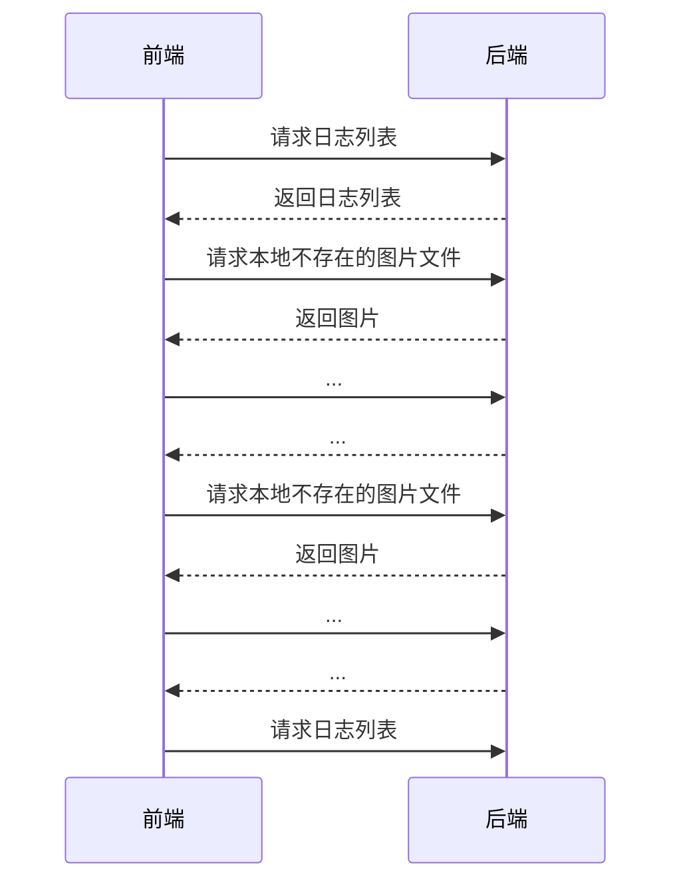

----------

----------

更新：2018/08/22

基本情况介绍
======

这个小应用从2018年七月份开始断断续续写，大致框架参考了慕课网上的一个课程@慕课网，并采用了新浪微博的 Java SDK 实现了将个人日记同步到个人微博的功能。
本着梳理项目结构以及方便后期完善功能的目的，暂时先将已经实现的功能展示出来。
项目 GitHub：https://github.com/RThymer/MyDiary

应用结构
----

前端：微信小程序（基本与html、css、json等价）

- 开发环境：微信web开发者工具

后端：SpringBoot 2.0.3、 MyBatis 1.3.1、 weibo4j-oauth2-beta3.1.1

- 开发环境：JetBrains IntelliJ Idea 2018.1、 JDK 1.8

开发环境网络拓扑：


页面结构

| 入口 | 列表页 | 单条内容编辑页 | 
| ------------- |:-------------:| -----:| 
|  |  |  | 


前端部分
====

首页，也即是入口，是微信官方的例子里提供的参考入口，点击头像即可以进入某一个页面，将导航至的页面设置为日志列表既可以实现跳转。
进入到日志列表中，是一个由多个日志组成的列表，初始状态下是没有内容的，选择新建按钮，进入单条日志编辑界面，可以新增日志内容、选择一张图片并保存；当在日志列表界面中选择某条日志时，也会跳到这个界面，但是其内容是已存在的，当然内容和图片都可以修改。

单条日志组成：
```
data: {
    diaryId: null,
    ownerName: '',
    dateTime: '',
    textContent: '',
    imgPath: '',
  },
```

1 日志列表页面
--------

**1.1 日志列表页面wxml文件配置（不完整，仅展示重点部分）：**

```
  <scroll-view class='scroll_content_list' scroll-y="true">
    <block wx:for="{{content_list}}" wx:key="diaryId">
      <view class='single_content'>
        <view bindtap="single_content_tap" id="{{item.diaryId}}" data-owner="{{item.ownerName}}" data-date="{{item.dateTime}}" data-text="{{item.textContent}}" data-image="{{item.imgPath}}">
          <view class='content_text'>
            <text>{{item.textContent}}</text>
          </view>
          <view class='img_view'>
            <image class='img_show' src="{{item.imgPath}}" style='height: 200px;' mode='aspectFit'></image>
          </view>
        </view>
      </view>
    </block>
  </scroll-view>
```

这一部分主要负责日志列表的展示，关键在于使用wx:for=”{{var}}”逐条列出，新版的微信开发提示最好指定遍历的主键值以提高性能，也就是后面wx:key=”diaryId”的由来。遍历的变量content_list来自于同页面的js文件中的’data’。需要取出子项时需要{{item.subVar}}调用，其中item变量为固定，subVar为var变量里定义的子项。综上即可实现在一个页面中排列一系列日志项目，且各个子项都可以在定义的页面数据中读取。

**1.2 三个按键及绑定的事件：**

```
<view class="button">
  <button class='warn_button' type='warn' size="default" bindtap="delete_tap">删除</button>
  <button class='sync_button' type='primary' size="default" bindtap="sync_tap">同步</button>
  <button class='new_button' type='default' size="default" bindtap="new_tap">新建</button>
</view>
```

该页面下方定义了三个按钮，分别为删除按钮、同步按钮、新建按钮。删除按钮实现删除单条或多条日志，同步按钮实现将所选日志记录同步到新浪微博，新建按钮实现增加一项日志功能，可以同时附加一张图片。具体的实现将在下面讨论。

**1.3 日志列表页面绑定的事件函数：**

```
single_content_tap: function(e) {
    console.log(e.currentTarget);
    wx.navigateTo({
      url: '../content/content?id=' + e.currentTarget.id +
        '&owner=' + e.currentTarget.dataset.owner +
        '&date=' + e.currentTarget.dataset.date +
        '&text=' + e.currentTarget.dataset.text +
        '&image=' + e.currentTarget.dataset.image,
    })
  },
```
这个函数绑定于每个日志点击事件，点击后进入单条日志显示与编辑界面。从单条日志点击进入后自然是要把日志内容显示出来，为了获得需要显示的日志内容，当然需要知道被点击的是哪一条日志了。所以函数有个传入参数e，表示的就是点击事件，需要获取点击的日志内容的话，调用的方式是：e.currentTarget.dataset.var，这个var变量需要在wxml文件里预先声明才可用，声明的方式是data-var，对应的就是上面的dataset.var。这部分在日志列表页面wxml文件配置中已经展示了。
函数中指定跳转的url，带上参数就可以把日志信息传给单条日志显示页面了。

**1.4 勾选框状态改变绑定事件函数**

因为涉及到日志列表批量操作，所以需要知道选择了哪些日志条目，这里便采用了勾选框来实现。每次勾选框被选上或者取消，都触发状态改变函数。这里在日志列表界面维护了一个变量，记录哪些id对应的日志被勾选了。每当事件函数被触发，首先判断已选id列表中有没有这个id，没有的话便将这个id加入列表，存在的话便删除：
```
    for (let i = 0; i < id_list.length; i++) {
      if (id_list[i] == e.target.id) {
        exist = true;
        loc = i;
      }
    }
    if (exist) {
      id_list.splice(loc, 1);
    } else {
      id_list.push(e.target.id);
    }
```
注：splice函数删除某索引位置的若干个元素。

这里虽然采用了蛮力遍历的方法，但是考虑到用户不会一次性勾选大量的日志条目，所以不用特意去专门给这个列表排序或者哈希之类的处理。当然很显然的一个可优化的地方是：在找是否存在某个id的函数中可以从后向左遍历，因为用户勾选后直接反悔的概率比勾选后反悔前面已勾选日志条目要低。
```
for (let i = id_list.length - 1; i >=0 ; i--) {
      if (id_list[i] == e.target.id) {
        exist = true;
        loc = i;
      }
    }
```

**1.5 新建日志按钮点击时间函数：**
这个函数最简单，跳转去单条日志页面，带上id为0即可，由单条日志页面去判断id的值。
```
new_tap: function() {
    wx.navigateTo({
      url: '../content/content?id=0'
    })
  },
```

**1.6 删除按钮点击事件函数：**

这里偷懒了，写这部分的时候后端程序已经写好了，没有提供批量删除的接口，所以这里暂时是遍历已勾选id列表，逐个向后端发送，显然这是非常糟糕的办法：
```
for (let i = 0; i < id_list.length; i++) {
    wx.request({
        url: 'http://192.168.50.177:8080/diary/admin/removediary',
        data: {
            "diaryId": id_list[i]
        },
        method: 'GET',
        success: function(res) {
            console.log(res);
            var result = res.data.success;
            if (result) success_count = success_count + 1;
        }
    });
    wx.showLoading({
        title: '执行中',
    })
    setTimeout(function() {
        var toastMsg = '成功了' + success_count + "个";
        wx.showToast({
            title: toastMsg,
            icon: '',
            duration: 2000
        });
    }, 3000)
    setTimeout(function() {
        wx.hideLoading()
        }, 1000)
    }
```
虽然很糟糕，我还是分析一下吧：首先由一个循环遍历已勾选的日志id列表，对于每一个id，向后端发送一个请求，带上这个id参数。因为在前端考虑，响应速度是第一位的，这些请求和前端代码是不同线程执行的，所以在后面加上了延时函数，等待请求执行完毕并统计成功删除的个数。然后将信息显示出来，还不能忘了将wx.showLoading隐藏。
这个函数后期肯定需要修改，想法暂时是将整个id列表一次传到后台，在后台再写一个批量删除的模块，这样不仅可以满足并发，也可以提高程序本身的健壮性。

**1.7 同步按钮点击事件函数：**

同步就与删除不同了，按照常理来说，一个人不会一股脑把大量的日志同步到新浪微博（其实这样一想把同步按钮放到单条日志部分更合理）， 所以不存在批量同步的问题，这个情况有两种解决方案：

在前端处理，每按一次同步按钮只同步一条日志，并将这条日志的勾选取消（或者不取消，考虑到还有后续的处理要求）；
在后端处理，一次性将需要同步的列表传到后端，后端再设置定时处理同步到新浪微博的任务。
这两种方案各有优劣，且都可以实现。
这里还是先把之前已经写好的同步函数列出来，同样是个很糟糕的实现方式：
```
sync_tap: function() {
    var _this = this;
    var id_list = _this.data.selected_id;
    for (let i = 0; i < id_list.length; i++) {
      wx.request({
        url: 'http://192.168.50.177:8080/diary/postweibo/api?diary_id=' + id_list[i],
        method: 'POST',
        success: function(res) {
          console.log(res);
        }
      });
    }
  },
```
其中发送新浪微博的过程需要在后端处理，这里只需要传入对应的日记id即可。

**1.8 页面加载函数：**

这一部分的实现更改了许多次，因为开发途中出现了一个措手不及的问题：最开始的实现是预先将图片放到指定位置，将图片路径写入数据库，加载页面的时候直接根据读到的图片路径寻找图片并显示，然而我们实际使用的时候并不会自己处理这个过程。
所以很自然想到了新建日志的时候把所选的图片复制到指定目录下，然而：微信选取某一个图片后，会创建一个临时文件，名称为tmp_xxx…且不提供更改文件名的方法，这样一来原来数据库里的图片路径就失效了。而且作为服务器端考虑，用户前端拉取日志列表时存在找不到图片可能性，这种情况下需要向服务器请求图片数据，而从服务器下载下来的图片文件又需要和数据库中的保持一致。
这样的话只能加载页面的时候根据数据库中的图片路径从服务器下载相应的图片，保存到本地时是一个临时的图片文件，但是没有判断本地图片是否存在，每次都需要从服务器下载。今后尽力优化这个逻辑。

首先从后端获取日志列表：
```
	wx.request({
      url: 'http://192.168.50.177:8080/diary/admin/listdiary',
      method: 'GET',
      data: {},
      success: function(res) {
        var list = res.data.diaryList;
        console.log(list);

        if (list == null) {
          var toastMsg = '获取数据失败了:' + res.data.errMsg;
          wx.showToast({
            title: toastMsg,
            icon: '',
            duration: 3000
          });
        } else {
          var cur_list = _this.data.content_list;
          console.log(cur_list);

          _this.setData({
            content_list: list,
          });
          }
      }
	)}
```
每个日志请求下载对应的图片
```
		for (let i = 0; i < list.length; i++) {
            wx.getFileInfo({
              filePath: list[i].imgPath,
              success(res) {
                console.log(res);
              },
              fail(res) {
                console.log(res);
                console.log(list[i].imgPath);
                var path_split = list[i].imgPath.split('/');
                var file_name = path_split[path_split.length - 1];
                wx.downloadFile({
                  url: 'http://192.168.50.177:8080/diary/download?filename=' + file_name,
                  success: function(res) {
                    if (res.statusCode == 200) {
                      console.log(res.tempFilePath)
                      _this.data.content_list[i].imgPath = res.tempFilePath
                      _this.setData({
                        content_list: _this.data.content_list
                      })
                    }
                  }
                })
              },
            })
```

2 单条日志界面
--------

**2.1 页面加载事件函数**

这个函数很好写，根据传入的日记id分别初始化页面即可：
```
onLoad: function(options) {
    if (options.id != 0) {
      this.setData({
        diaryId: options.id,
        ownerName: options.owner,
        dateTime: options.date,
        textContent: options.text,
        imgPath: options.image,
      });
    } else {
      this.setData({
        diaryId: null,
        ownerName: 'robot',
        dateTime: '',
        textContent: '',
        imgPath: '',
      });
    }
},
```

**2.2 文本框事件函数：**
```
input_text: function(e) {
    this.setData({
      textContent: e.detail.value,
    });
  },
```

**2.3 选图按钮点击事件函数**

简单的微信API： wx.chooseImage即可，把临时文件路径传给页面数据imgPath即可。
```
picButtonTap: function(e) {
    var _this = this;
    console.log(e);
    wx.chooseImage({
      count: 1, // 默认9
      sizeType: ['original', 'compressed'],
      sourceType: ['album', 'camera'],
      success: function(res) {
        console.log(res);
        _this.setData({
          imgPath: res.tempFilePaths[0],
        })
      },
    });
  },
```

**2.4 保存按钮事件函数**
和上面日记列表页面遇到的问题一样，结果多次更改需求，暂时的实现方案是：首先将临时文件上传到后端：
```
wx.uploadFile({
      url: 'http://192.168.50.177:8080/diary/upload',
      filePath: imgUrl,
      name: 'file',
      formData: {
        'user': 'test'
      },
      success: function(res) {
        console.log(res);
        var data = res.data;
      }
    });
```
然后根据传入页面参数确定是请求修改日记的url还是增加日记条目的url：
```
if (_this.data.diaryId == null) {
      reqUrl = 'http://192.168.50.177:8080/diary/admin/adddiary';
    } else {
      reqUrl = 'http://192.168.50.177:8080/diary/admin/modifydiary';
}
```
最后向后端发送请求，需要将日志的具体内容转化为json对象：
```
	wx.request({
      url: reqUrl,
      data: JSON.stringify({
        'diaryId': _this.data.diaryId,
        'ownerName': _this.data.ownerName,
        'dateTime': _this.data.dateTime,
        'textContent': _this.data.textContent,
        'imgPath': _this.data.imgPath
      }),
      method: 'POST',
      header: {
        'Content-Type': 'application/json'
      },
      success: function(res) {
        console.log(res);
        var result = res.data.success;
        var toastContent = "操作成功！";
        if (result != true) {
          toastContent = "操作失败了:" + res.data.errMsg;
        }
        wx.showToast({
          title: toastContent,
          icon: '',
          duration: 3000
        });
      }
    })
```

后端部分
====

**实体类**
包含一个日志记录的成员和基本get、set方法(这里不展示方法体)
```
public class DiaryEntry {
    private Integer diaryId;
    private String ownerName;
    private Date dateTime;
    private String textContent;
    private String imgPath;
    public Integer getDiaryId() { }
    public void setDiaryId(Integer diaryId) { }
    public String getOwnerName() { }
    public void setOwnerName(String ownerName) { }
    public Date getDateTime() { }
    public void setDateTime(Date dateTime) { }
    public String getTextContent() { }
    public void setTextContent(String textContent) { }
    public String getImgPath() { }
    public void setImgPath(String imgPath) { }
}
```

**DAO层：**

```
public interface DiaryDao {
    List<DiaryEntry> queryDiaryEntry();
    DiaryEntry queryDiaryById(int diaryId);
    int insertDiary(DiaryEntry diary);
    int updateDiary(DiaryEntry diary);
    int deleteDiary(int diaryId);
}
```

根据需要的服务编写服务层，先编写接口后提供实现：

**Service层接口：**
```
public interface DiaryService {
    List<DiaryEntry> getDiaryEntryList();
    DiaryEntry getDiaryById(int diaryId);
    boolean addDiary(DiaryEntry diary);
    boolean modifyDiary(DiaryEntry diary);
    boolean deleteDiary(int diaryId);
}
```
**Service层实现：**

```
@Service
public class DiaryServiceImpl implements DiaryService {

    @Autowired
    private DiaryDao diaryDao;
    ...
}
```
首先使用@Service注解向SpringBoot说明这个类属于服务。在类内使用@Autowired注解自动装配DiaryDao，也就是上面DAO层里的接口。
实现Service层逻辑(只列出代表性的，逻辑类似的不重复举例)：

```
	@Override
    public DiaryEntry getDiaryById(int diaryId) {
        return diaryDao.queryDiaryById(diaryId);
    }

    @Transactional
    @Override
    public boolean addDiary(DiaryEntry diary) {
        if (diary.getOwnerName() != null && !"".equals(diary.getOwnerName())) {
            diary.setDateTime(new Date());
            try {
                int returnNum = diaryDao.insertDiary(diary);
                if (returnNum > 0) {
                    return true;
                } else {
                    throw new RuntimeException("新增日记失败了。。。");
                }
            } catch (Exception e) {
                throw new RuntimeException("新增日记失败了:" + e.getMessage());
            }
        } else {
            throw new RuntimeException("创建人都没有？");
        }
    }
```
**Web层逻辑**
这一层逻辑直接与前端交互，所以基本上最容易出问题的就在这里。弄清楚SpringBoot的工作原理，写起来也不是很难。

**日记增删改查的Controller**
(只展示代表性的，其余的逻辑类似便不赘述了):

```
@Controller
@ResponseBody
@RequestMapping("/admin")
public class DiaryController {
    @Autowired
    private DiaryService diaryService;
    
    @RequestMapping(value = "/listdiary", method = RequestMethod.GET)
    private Map<String, Object> listDiary() {
        Map<String, Object> modelMap = new HashMap<>();
        List<DiaryEntry> list = diaryService.getDiaryEntryList();
        modelMap.put("diaryList", list);
        return modelMap;
    }
}
```
@Controller和@ResponseBody两个注解分别向SpringBoot说明此类是一个控制类和说明方法返回值需要以json格式处理。这两个注解也可以以一个@RestController代替，这也是SpringBoot节省配置的一个典型例子。
@RequestMapping("/admin") 注解是请求的映射路径，也就是请求的url的相对路径。
返回值是一个Map，也是考虑到方便前端处理数据，不需要判断接收到的json是什么类型。以统一的格式返回给前端：正常返回时返回的Key是名称，需要返回错误时指定Key是错误状态，内容是错误码。这也是从慕课网的课程里学到的。
可能初学者会好奇，明明返回的是一个Map，为什么到了前端就变成了一个json对象？这其实是SpringBoot的功劳，对它来说前后端沟通默认采用的都是json对象，所以当指定@ResponseBody注解后，它会把返回对象转换为json对象并发送给调用者。

**前端上传下载图片Controller：**
这也是需求更新后增加的一个web层controller, 前端新增日志的时候选定图片，便从这个url上传：

```
	@RequestMapping("/upload")
	public String upload(@RequestParam(value = "file") MultipartFile file){
        if (file.isEmpty()) {
            return "文件为空哦。";
        }

        String fileName = file.getOriginalFilename();
        String filePath = "/home/rthymer/Documents/DiaryPics/";
        File dest = new File(filePath + fileName);
        if (!dest.getParentFile().exists()) {
            dest.getParentFile().mkdirs();
        }
        try {
            file.transferTo(dest);
            return "上传成功了！";
        } catch (IllegalStateException e) {
            return "上传失败了哟:非法状态" + e.getMessage();
        } catch (IOException e) {
            return "上传失败了哟:IO错误" + e.getMessage();
        }
    }
```
这里需要指定传入参数，使用@RequestParam(value = "file")注解指定传入参数名称，之后就是简单的文件处理步骤了。

处理下载时传入的文件与数据库文件名一致，这里直接将图片文件转化为FileInputStream，再以OutputStream 保存为文件，使用1024个字节的数组缓存。最后直接根据文件名直接指定文件路径，这个过程有很多可参考的代码，示例如下：
```
@RequestMapping(value = "/download")
    public String downloadFile(HttpServletRequest request, HttpServletResponse response) {
        String fileName = request.getParameter("filename");
        String realPath = "/home/rthymer/Documents/DiaryPics/";
        if (fileName != null) {
            File file = new File(realPath, fileName);
            if (file.exists()) {
                response.setContentType("application/force-download");
                response.addHeader("Content-Disposition",
                        "attachment;fileName=" + fileName);
                byte[] buffer = new byte[1024];
                FileInputStream fis = null;
                BufferedInputStream bis = null;
                try {
                    fis = new FileInputStream(file);
                    bis = new BufferedInputStream(fis);
                    OutputStream os = response.getOutputStream();
                    int i = bis.read(buffer);
                    while (i != -1) {
                        os.write(buffer, 0, i);
                        i = bis.read(buffer);
                    }
                    System.out.println("success");
                } catch (Exception e) {
                    e.printStackTrace();
                }
                ...
			}
}
```
这里也提供了另一种获得请求参数的方法：request.getParameter("filename")，需要传入HttpServletRequest参数。

测试后服务器端获得的图片：


**同步新浪微博Controller：**
网上能找到各种调用新浪API发微博的文章，但是很多文章都失去了时效性，原因是微博官方在2017年调整了接口，取消了网上现有教程中的发送微博的接口(updateStatus),如果再调用此接口都会提示权限不足。调整接口之后，只能作为第三方，通过使用*share*接口分享状态而不是发送状态，不过这不妨碍功能的实现，无非就是发送微博的小尾巴变了而已。
需要调用新浪的SDK接口，必须作为开发者登录新浪开发者平台并获取APP ID以及使用APP ID获取令牌，有了令牌才能分享。需要说明这个令牌的有效期直接和注册的应用相关，过期了需要重新获取（然而我实测24小时有效期的令牌过了半个月仍然有效，Bug?）。
毕竟是参考别人的工作，我这里重复一遍也没意思，放上[链接](https://blog.csdn.net/qq_36580777/article/details/77532760)，移步学习即可。下面主要介绍我自己遇到的新问题和解决方案。
首先打开examples包下的oauth2.0下的OAuth4Code.java文件（需要JDK 为1.8！），运行便会打开一个浏览器页面，根据提示操作既可以获取到授权码，这个授权码就是上面说到的令牌。把这个令牌传入Timeline()即可以调用share方法分享微博了。
注：作为分享而不是发送，微博内容需要在最后加上分享网址，这里简单起见直接填百度。

```
public boolean postWeibo(String content, Integer id) {
        String accessToken = "2.00xxx...xxx";
        String contentWeibo = content + " https://www.baidu.com/";
        Timeline timeline = new Timeline(accessToken);
        try {
            Status status = timeline.share(contentWeibo);
            //Log.logInfo(status.toString());
        } catch (WeiboException e) {
            e.printStackTrace();
        }
}
```
哪里有这么简单，这只是发了文字而已，我们还需要带上图片，虽然SDK提供了带图片的API，但是需要将图片预先转换为字节数组。
```
public Status share(String status, ImageItem item) throws WeiboException {}
```
转换为字节数组并不是这么简单，这里又有个问题了：微信创建的临时文件里面含有多个'.'，使用Java的类处理直接转换字符数组时出现错误。在网上找到了可行的方法：采用读入FileInputStream，保存为新文件名，并将新文件转换为字符数组，这样便可以了：

```
public boolean postWeibo(String content, String pic, Integer id) {
        String accessToken = "2.00xxx...xxx";
        String contentWeibo = content + " https://www.baidu.com/";
        String picPath = "/home/rthymer/Documents/DiaryPics/" + pic;

        File sourcefile = new File(picPath);
        File tempFile = new File("/home/rthymer/Documents/DiaryPics/diaryId_" + id + ".jpg");

        try {
            InputStream inputStream = new FileInputStream(sourcefile);
            OutputStream outputStream = new FileOutputStream(tempFile);
            int byteCount = 0;
            byte[] bytes = new byte[1024];
            while ((byteCount = inputStream.read(bytes)) != -1) {
                outputStream.write(bytes, 0, byteCount);
                outputStream.flush();
            }
            inputStream.close();
            outputStream.close();
        } catch (FileNotFoundException e) {
            e.printStackTrace();
        } catch (IOException e) {
            e.printStackTrace();
        }

        BufferedImage bufferedImage;
        try {
            bufferedImage = ImageIO.read(tempFile);
            ByteArrayOutputStream byteArrayOutputStream = new ByteArrayOutputStream();
            ImageIO.write(bufferedImage, "jpg", byteArrayOutputStream);
            byte[] bytes = byteArrayOutputStream.toByteArray();
            Timeline timeline = new Timeline(accessToken);
            try {
                Status status = timeline.share(contentWeibo, new ImageItem(bytes));
                //Log.logInfo(status.toString());
            } catch (WeiboException e) {
                e.printStackTrace();
            }
        } catch (IOException e) {
            e.printStackTrace();
        }
        return true;
    }
```

下面是最终同步成功的效果：


其实除下采用新浪SDK同步微博，还可以直接模仿网页访问微博网址，暴力发送，只需要找到元素的位置即可，也已经有人这样做了，但是年代久远，现在微博采用更先进的手势验证，连登录都是个麻烦事。
最后总结一下这一小部分，其实这一套逻辑下来发现了很多可以优化的地方，最主要的集中于图片的命名上：我可以直接在数据库上保存非临时文件名，用于微博的时候就不用新建一个文件了；我可以每次上传新图片的时候在后端改文件名，就不用面对前端重复下载的问题了。这些都可以以后有时间慢慢优化。

**最后放上各种配置文件及起的作用：**

*SpringBoot 配置文件application.properties*
```
#Server
server.address=192.168.50.177
server.port=8080
server.servlet.context-path=/diary

#JDBC
jdbc.driver=com.mysql.jdbc.Driver
jdbc.url=jdbc:mysql://localhost:3306/mydiary?useUnicode=true&characterEncoding=utf8&useSSL=false
jdbc.username=xxx
jdbc.password=xxx

#Mybatis
mybatis_config_file=mybatis-config.xml
mapper_path=/mapper/*.xml
entity_package=com.rthymer.mydiary.entity

#Spring return date format
spring.jackson.date-format=yyyy-MM-dd HH:mm:ss
spring.jackson.time-zone=GMT+8

#Spring boot upload file size limit
spring.servlet.multipart.max-file-size=10MB
spring.servlet.multipart.max-request-size=100MB
```
需要特殊说明的是Spring返回日期格式的配置和上传最大文件大小的配置，这些都是在实际开发过程中遇到的问题。由于在JAVA中Date类的事件默认格式和前端显示的格式不匹配，出现不显示的情况，便在后端强制指定默认的日期格式，这也会影响到数据库中的日期字段。然后是从前端上传文件到后端的时候默认的上传限制经常大于图片的大小，所以也在这里指定上传的最大文件大小和最大的下载文件大小。

*微博SDK配置文件config.properties*

```
client_ID=xxx
client_SERCRET=xxx
redirect_URI=https://api.weibo.com/oauth2/default.html
baseURL=https://api.weibo.com/2/
accessTokenURL=https://api.weibo.com/oauth2/access_token
authorizeURL=https://api.weibo.com/oauth2/authorize
rmURL=https://rm.api.weibo.com/2/
```
很简单，需要指定前两行内容，在微博开发平台找到自己的应用信息即可，回传地址一般不变，找个例子学习即可。

*MyBatis 配置文件 mybatis-config.xml*
> MyBatis 是一款优秀的持久层框架，它支持定制化 SQL、存储过程以及高级映射。MyBatis 避免了几乎所有的 JDBC代码和手动设置参数以及获取结果集。MyBatis 可以使用简单的 XML 或注解来配置和映射原生信息，将接口和 Java 的POJOs(Plain Old Java Objects,普通的 Java对象)映射成数据库中的记录。

```
<?xml version="1.0" encoding="UTF-8"?>
<!DOCTYPE configuration
        PUBLIC "-//mybatis.org//DTD Config 3.0//EN"
        "http://mybatis.org/dtd/mybatis-3-config.dtd">
<configuration>
    <settings>
        <!--使用jdbc的getGeneratedKeys获取数据库自增主键值-->
        <setting name="useGeneratedKeys" value="true"/>
        <!--使用列标签替换别名-->
        <setting name="useColumnLabel" value="true"/>
        <!--开启驼峰命名转换: Table{create_time} -> createTime-->
        <!--这是我的Spring boot第二个Bug所在-->
        <setting name="mapUnderscoreToCamelCase" value="true"/>
    </settings>
</configuration>
```

我也是学习了之后才意识到MyBatis的强大之处，一般情况下我们需要指定数据库的列名和java bean之间的映射关系，但是上面的配置文件并没有写mapper，原因在于它支持驼峰命名转换，数据库里面的create_time可以转换为Java Bean 里的createTime，省去了重复的配置过程，但是这样也带来一个不便：Java Bean 里面的属性需要和数据库里面的属性有这种对应关系，耍点小聪明还好，遇到大型的开发还是老老实实一一映射吧。

*MyBatis DAO配置文件 diaryDao.xml*
这里只列出两个操作数据库的条目，其余的基本上类似：

```
<?xml version="1.0" encoding="UTF-8"?>
<!DOCTYPE mapper
        PUBLIC "-//mybatis.org//DTD Mapper 3.0//EN"
        "http://mybatis.org/dtd/mybatis-3-mapper.dtd">
<mapper namespace="com.rthymer.mydiary.dao.DiaryDao">
    <select id="queryDiaryById" resultType="com.rthymer.mydiary.entity.DiaryEntry">
        SELECT diary_id, owner_name, date_time, text_content, img_path
        FROM diarytable
        WHERE diary_id=#{diaryId}
    </select>
    <update id="updateDiary" parameterType="com.rthymer.mydiary.entity.DiaryEntry">
        UPDATE diarytable
        <set>
            <if test="ownerName!=null">owner_name=#{ownerName},</if>
            <if test="dateTime!=null">date_time=#{dateTime},</if>
            <if test="textContent!=null">text_content=#{textContent},</if>
            <if test="imgPath!=null">img_path=#{imgPath}</if>
        </set>
        WHERE diary_id=#{diaryId}
    </update>
</mapper>
```
配置文件中的id="*queryDiaryById*"需要与DAO层的DiaryDao接口中*queryDiaryById*方法相互对应，parameterType="com.rthymer.mydiary.entity.DiaryEntry"声明传入参数的类型，也就是前面声明的实体类。
SQL语句中，若需要用到传入参数的变量，调用方式是#{*var*}，不用这种方法调用的字段会直接传入数据库运行。
注：MyBatis有两种传参方式：```#{}```，和 ```${}```。传参的区别如下：使用```#{}```传入参数时，SQL语句解析会加上```""```当成字符串来解析，```${}```直接替换，#{}传参能防止sql注入，但是当SQL语句中变量不能出现双引号时，只能选择```${}```。

```
<set>
<if test="ownerName!=null">owner_name=#{ownerName},</if>
...
</set>
```
这里面的语句是课程里面提供的，意思是假设字段```ownerName```不为空，便将后面的字段加入，这样便起到更新的作用，无形之中也减轻了数据库的负担。
这一部分已确定需要加入批量删除的功能。

----------

----------

更新 2018/08/25

- 完善批量删除功能
- 完善前端图片下载处理逻辑
- 同步微博的前端优化

想要批量删除日志条目，除下需要将日志id列表从前端传送到后端，还需要处理MyBatis的DAO配置文件，下面分这两个部分来说明。

**日志id列表的前后端沟通**

```
private Map<String, Object> removeDiary(Integer diaryId) {}
```
由于在课程上直接将id以整型变量传入的方式是可行的，所以最开始考虑的是直接接收整型数组
```
private Map<String, Object> removeDiaries(Integer[] diaryIdList) {}
```
有点经验的开发人员都知道这样是行不通的，我在前端指定的是json对象：

```
	data: {
		"diaryIdList": id_list
	},
```
后端得到这个json对象会不知所措，因为结构并不能完全匹配，所以当我在这个函数内打上断点时，发现程序完全不会进入函数体执行。
病急乱投医地搜索别人的例子，尝试了```RequestParam```、```RequestBody```、```int[]```、在前端改变数据结构，均没有效果，后来找到一篇博客跟着学习了前后端数据类型的匹配，发现了这里的问题，原博里是这样解决的：

```
	private Map<String, Object> removeDiaries(@RequestBody Map<String,Object> params) {
        Object values = params.get("diaryIdList");
        ...
```
也就是说，前端传来的json对象可以映射成Map参数，"diaryIdList"是Map的键，值直接以Object传入，拿到对象之后再作转化。这种方式很棒，我之前像无头苍蝇乱撞、乱试地解决问题，现在更加深了理解。下面是借着这个思路写的代码：

```
@RequestMapping(value = "/removediaries", method = RequestMethod.POST)
    private Map<String, Object> removeDiaries(@RequestBody Map<String,Object> params) {
        Object values = params.get("diaryIdList");

        @SuppressWarnings("unchecked")
        List<String> list = (ArrayList<String>) values;

        int[] diaryIdList = new int[list.size()];
        for (int index = 0; index < list.size(); index++) {
            diaryIdList[index] = Integer.parseInt(list.get(index));
        }

        Map<String, Object> modelMap = new HashMap<>();
        modelMap.put("success", diaryService.deleteDiaries(diaryIdList));
        return modelMap;
    }
```
可以发现虽然可以解决问题，但是要涉及到大量的转型，复杂且冗余。思考了一段时间，考虑到SpringBoot有自动转型的能力，为什么要指定值为Object对象呢？我明明知道传入的参数是什么类型，可不可以直接指定？

```
	@RequestMapping(value = "/removediaries", method = RequestMethod.POST)
    private Map<String, Object> removeDiaries(@RequestBody Map<String, List<Integer>> params) {
        List<Integer> idList = params.get("diaryIdList");
        Map<String, Object> modelMap = new HashMap<>();
        modelMap.put("success", diaryService.deleteDiaries(idList));
        return modelMap;
    }
```
事实证明是可以的，把Object换成```List<Integer>```，SpringBoot可以自动转换。传入的参数是一个只有```"diaryIdList"```键的Map，需要把其中的值取出。虽然这样需要修改已经编写好的各个接口、service，但是换来代码的简洁还是很值得的。至于这些修改的接口定义，这里就不展示了。

**MyBatis的DAO批量删除配置编写**

```
	<delete id="deleteDiary" parameterType="int">
        DELETE FROM diarytable
        WHERE diary_id=#{diaryId}
    </delete>
```
这是删除单条的SQL语句，既然传入的参数不是int型了而是```List<Integer>```，把它改掉，再修改WHERE语句即可。

```
<delete id="deleteDiaries" parameterType="java.util.List">
        DELETE FROM diarytable
        WHERE diary_id IN (
        <foreach collection="list" item="item" separator=",">
            #{item}
        </foreach>
        )
    </delete>
```
把parameterType改为"java.util.List"，在需要删除的id列表中逐个加入即可。这里使用了foreach，加上逗号为分隔符即可，写法都很固定。（当输入的参数是数组时，collection需要指定为array）

**前端加载日志列表逻辑**
在没有完善这个逻辑之前，每一次加载页面，都需要完成请求列表、依据列表中的图片路径检查本地是否存在，不存在的话便请求下载原图，并将新下载的图片路径改到页面数据对应的日志列表中。细想一下便知道只要本地没有数据库中的文件，每次显示日志列表页面都需要向服务器请求原图。虽然逻辑没有太大问题，但是这样的操作很反人类：超慢的页面加载，无形之中服务器端的压力也变大。


**前端下载图片过程优化**
首先，考虑到减轻带宽的压力，在前端请求下载图片时把原图压缩，在前端上传图片时保持原图不变。采用了Thumbnailator库实现图片的压缩：

```
	private void scalePics(File sourcePath, File destinationPath) {
        try {
            Thumbnails.of(sourcePath).size(300,200).toFile(destinationPath);
        } catch (IOException e) {
            throw new RuntimeException("Error while scaling pics...");
        }
    }
```
实测这样下来前端的下载速度明显提升，页面响应速度也提高了不少，但是仍然体验不好。接下来想办法优化日志列表页的逻辑。

**优化前端日志列表逻辑**
主要包含两个内容，**选择性更新日志列表**与**删除日志条目后的页面刷新**。
**选择性更新日志列表**
我选择只在首次页面加载时更新页面日志列表、下载需要的图片。为什么其他情况下不需要呢？需要改动页面数据的情况只有三种：初次加载、删除日志和改动日志内容。初次加载我们确实会加载列表下载图片，删除日志情况也会对页面进行刷新，唯独改动日志内容的情况需要特别说明：用户在改动文本内容或者选取另外一张图片时，本地一定会有临时文件，文本自不必说，我们已经在本地保存了数据，也提交到数据库了，选取图片时，一定是从本地已有的图片选取，在微信本地临时文件中一定有这个文件，既然上传了原图，修改了数据库的内容和本地的数据，也就不必再向服务器请求一次日志列表数据了，删除日志内容自不必向服务器请求下载图片，只需在本地修改刷新页面即可，难度在于把单条日志修改的内容传递给日志列表页面。综上我们只需要处理初次加载的图片下载。
我设置了一个个页面数据，保存是否是初次加载，在onLoad函数体内判断这个变量即可：

```
		if (_this.data.loaded == 0) {
            _this.setData({
              content_list: list,
            });
		}
		...
		if (_this.data.loaded == 0) {
		//下载图片
		...
		...
		_this.setData({
            loaded: 1,
          });
        }
```
**修改单条日志后更新日志列表**
在单条日志页面下，当用户按下保存按钮，说明用户希望将数据固定下来，我们在这个时候保存缓存数据：

```
	wx.setStorage({
      key: "need_refresh",
      data: 1
    })
    wx.setStorage({
      key: "refresh_diary",
      data: _this.data
    })
```
接下来在```onShow```函数（每次显示都会加载）中判断是否需要刷新某一条：

```
	var _this = this;
    var need_refresh = wx.getStorageSync('need_refresh');
    if(need_refresh == 1) {
      var refresh_diary = wx.getStorageSync('refresh_diary');
      var diary_id = refresh_diary.diaryId;
      var diary_list = _this.data.content_list;
      for (let index = 0; index < diary_list.length; i++) {
        if (diary_list[index].diaryId == diary_id) {
          diary_list[index].ownerName = refresh_diary.ownerName;
          diary_list[index].dateTime = refresh_diary.dateTime;
          diary_list[index].textContent = refresh_diary.textContent;
          diary_list[index].imgPath = refresh_diary.imgPath;
          _this.setData({
            content_list: diary_list,
          });
          wx.setStorage({
            key: "need_refresh",
            data: 0
          })
          break;
        }
      }
    }
```

找到需要更新的日志索引并设置对应的数据就好了。效果如下：


**删除日志条目后的页面刷新**
有了上面的逻辑，处理删除条目后的页面更新就比较好办了，在函数内调用一次onLoad函数即可，既然是已经在日志列表页面处理，不是初次加载，自然不需要重新下载图片了。这里只展示删除多条的日志列表处理逻辑：

```
wx.request({
	url: 'http://192.168.50.177:8080/diary/admin/removediaries',
	data: {
		"diaryIdList": id_list
		 },
	method: 'POST',
	header: {
		'Content-Type': 'application/json'
		},
	success: function(res) {
		var list = _this.data.content_list;

		for (let i = 0; i < id_list.length; i++) {
			var list_length = list.length;
			for (let j = 0; j < list_length; j++) {
				if (list[j].diaryId == id_list[i]) {
					list.splice(j, 1);
					break;
				}
			}
		}
		id_list.splice(0, id_list.length);
		_this.setData({
		content_list: list,
		});
	}
...
...
...
_this.onLoad()
});
```
把无关的代码去掉后逻辑就清晰多了。首先当然是请求后端，把需要删除的id列表传送到后端，再逐一寻找所在的索引并删除，然后把需要删除的id列表清空，最后调用onLoad函数刷新页面。前面已经提到了，再刷新页面时不会向后端请求下载图片，因此这样的逻辑对页面的响应有很大的体验提升。

**同步微博的前端优化**
有了批量删除的经验，把需要同步的日志列表传给后端并同步微博并不是难事，这里图省事直接在前端限制只能同步一个，这样也符合逻辑：一次同步多条微博就是刷屏。

```
	if (id_list.length < 1) {
      wx.showToast({
        title: "不选择日志条目是不能同步的哦 :( ",
        icon: 'none',
        duration: 3000
      });
    }else if (id_list.length > 1) {
      wx.showToast({
        title: "请不要选择多个日志条目来同步",
        icon: 'none',
        duration: 3000
      });
    } else {
      wx.request({
        url: 'http://192.168.50.177:8080/diary/postweibo/api?diary_id=' + id_list[0],
        method: 'POST',
        success: function(res) {
          console.log(res);
          wx.showToast({
            title: "同步请求已提交 :)",
            icon: 'none',
            duration: 3000
          });
        }
      });
    }
```
设置简单的提示信息即可。


----------


----------
更新

- 优化单条日志页面传数据逻辑

之前是采用将数据写到url上，单条日志页面再从url读取数据的，问题在于url中以```?```和```&```作分隔符，一旦文本内容或者文件名中出现这两个字符，从url读取数据就会出错。
因此，同样是采用上面的设置缓存数据的方法，从缓存中读取数据，方便、健壮。
```
	var one_diary = wx.getStorageSync('one_diary');
      this.setData({
        diaryId: one_diary.id,
        ownerName: one_diary.dataset.owner,
        dateTime: one_diary.dataset.date,
        textContent: one_diary.dataset.text,
        imgPath: one_diary.dataset.image,
      });
```

至此，此应用基本逻辑清晰、功能健全、没有大BUG了，有可以改进的地方，烦请读者指正！